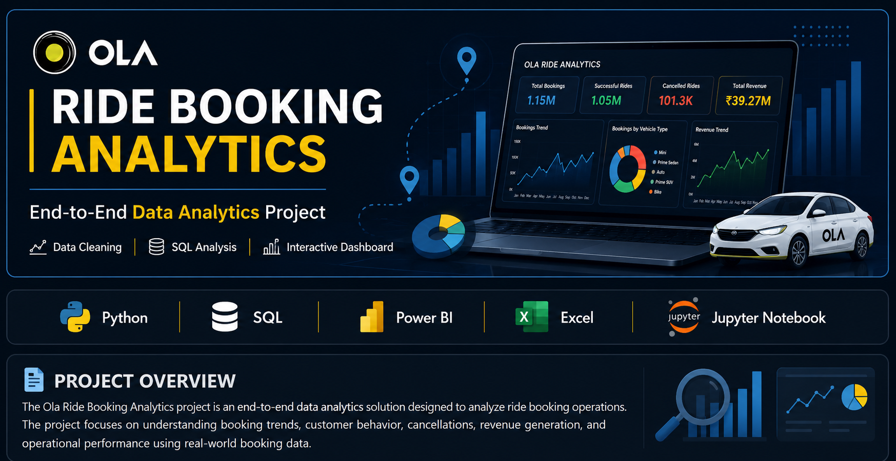

<p align="center">
  
</p>
 
 
 
 Ola Ride Booking Analytics

> **End-to-End Data Analytics Project using Python, SQL, Power BI, and Excel**

---

 Project Overview

The **Ola Ride Booking Analytics** project is an end-to-end data analytics solution designed to analyze ride booking operations. The project focuses on understanding booking trends, customer behavior, cancellations, revenue generation, and operational performance using real-world booking data.

The complete workflow includes data cleaning in Python, analysis using SQL, and interactive dashboard creation in Power BI.

---

 Business Problem

Ride-sharing companies generate thousands of bookings every day. Understanding customer demand, booking patterns, cancellations, and revenue trends helps businesses improve operational efficiency, increase customer satisfaction, and maximize profitability.

---

Tools & Technologies
 


- 🐍 Python
- 🗄️ SQL (MySQL)
- 📊 Power BI
- 📑 Microsoft Excel
- 📒 Jupyter Notebook

---

 Project Workflow

```text
Raw Dataset (Excel)
        │
        ▼
Python Data Cleaning
        │
        ▼
SQL Data Analysis
        │
        ▼
Power BI Dashboard
        │
        ▼
Business Insights
```

---

# 📊 Dashboard Preview

## Dashboard 1 – Executive Overview


---

## Dashboard 2 – Booking & Revenue Analysis


---

## Dashboard 3 – Customer & Cancellation Analysis


---

# 📈 Key Analysis Performed

- Booking Trend Analysis
- Revenue Analysis
- Cancellation Analysis
- Vehicle Type Performance
- Customer Booking Behavior
- Ride Status Analysis
- Interactive Dashboard Creation

---

# 💡 Key Business Insights

- Identified booking trends across different ride categories.
- Analyzed successful and cancelled ride patterns.
- Compared performance across different vehicle types.
- Evaluated customer booking behavior.
- Built an interactive dashboard for business decision-making.

---

# 📌 Business Recommendations

- Reduce ride cancellations through better driver allocation.
- Optimize vehicle availability during peak booking hours.
- Improve customer experience using booking trend insights.
- Monitor KPIs regularly using the Power BI dashboard.

---

# 📁 Repository Structure

```text
📂 Data
📂 dashboard
📂 images
📂 notebooks
📂 presentation
📂 reports
📂 sql
```

---

# 🚀 Skills Demonstrated

- Data Cleaning
- Data Analysis
- SQL Query Writing
- Power BI Dashboard Development
- Business Intelligence
- Data Visualization
- Problem Solving

---

# 👨‍💻 Author

**Abhishek_Anthony**

Aspiring Data Analyst

### Connect with me

- GitHub: https://github.com/AbhiDataLab
- LinkedIn: *(Add your LinkedIn profile here after we optimize it.)*
